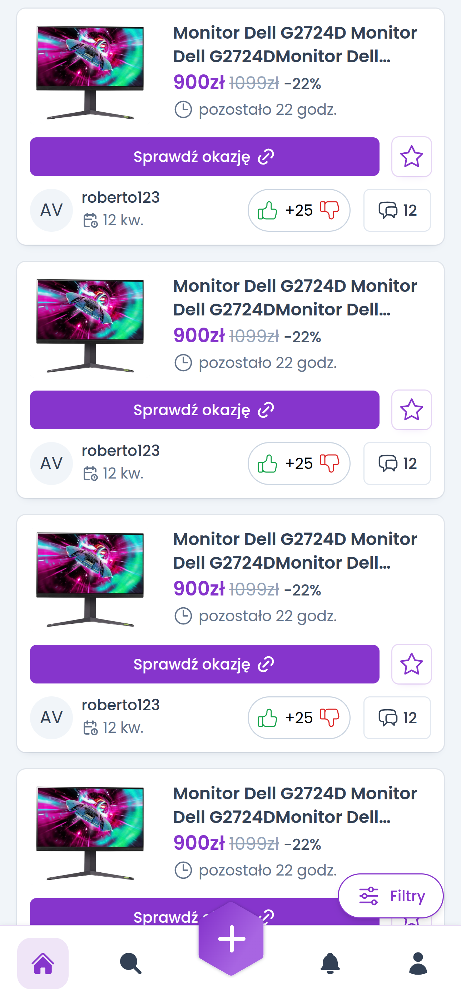

# Jafars Bag

Web application to browse discounts and special offers.

### Screenshot

### Built with

- [React](https://reactjs.org/) - JS library
- Tailwind
- Semantic HTML5 markup
- [Vite](https://vitejs.dev/)
- Mobile-first workflow
- Flexbox
- CSS Grid
